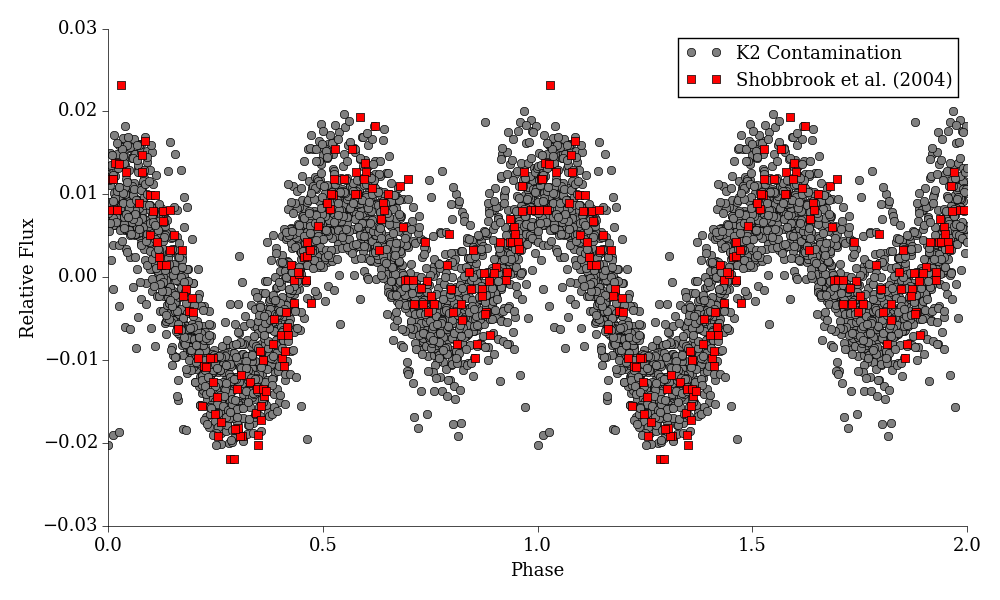

## K2 TSP Research Project ##
```
Supervisors: Tim Bedding, Daniel Huber, Simon Murphy
Institution: The University of Sydney
```

A research project to see if it is possible to do meaningful photometry on B
star contamination of Kepler K2 postage stamps. Specifically, we focus on
examples in campaign 2, but create general techniques which can be applied to
any other campaign (or to astronomy in general).

### &pi; Sco ###
This is an example of our analysis usnig aperture analysis, using
`EPIC 203442993`. This photometric analysis mirrors ground-based surveys of
&pi; Sco and has an incredible trendline.



### License ###
The source code under `scripts/` is licensed under version 2 of the GNU General
Public License:

```
keplerk2-halo: Halo Photometry of Contaminated Kepler/K2 Pixels
Copyright (C) 2015 Aleksa Sarai <cyphar@cyphar.com>

This program is free software; you can redistribute it and/or
modify it under the terms of version 2 of the GNU General Public
License as published by the Free Software Foundation.

This program is distributed in the hope that it will be useful,
but WITHOUT ANY WARRANTY; without even the implied warranty of
MERCHANTABILITY or FITNESS FOR A PARTICULAR PURPOSE.  See the
GNU General Public License for more details.

You should have received a copy of the GNU General Public License
along with this program; if not, write to the Free Software
Foundation, Inc., 51 Franklin Street, Fifth Floor, Boston, MA  02110-1301, USA.
```

The files under `data/` are all [publicly available][k2-archive] and are
provided by NASA in compliance with their [data use policy][k2-data-policy].

The `*.json` metadata was collated using both [SIMBAD][simbad] and
[MAST][k2-search], both of which are also public resources.

[k2-archive]: https://archive.stsci.edu/pub/k2/target_pixel_files/
[k2-data-policy]: https://archive.stsci.edu/data_use.html
[k2-search]: https://archive.stsci.edu/k2/data_search/search.php
[simbad]: http://simbad.u-strasbg.fr/simbad/
